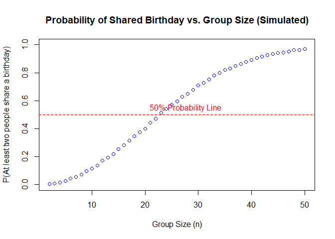
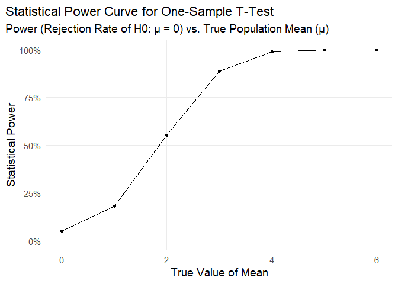
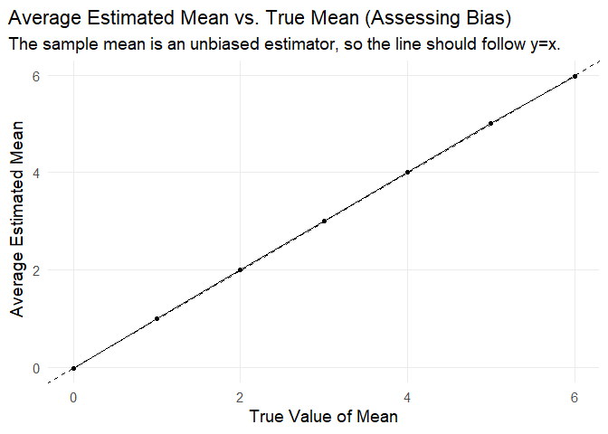
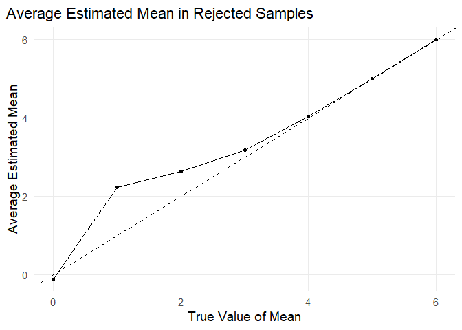

p8105_hw5_th3147
================
Te-Hsuan Huang
2025-11-14

# Loading the package

``` r
library(tidyverse)
```

    ## Warning: package 'tidyverse' was built under R version 4.5.2

``` r
library(broom)
```

# Problem 1

## Make function

``` r
simulate_birthday_match <- function(n) {

  birthdays <- sample(1:365, size = n, replace = TRUE)
  has_duplicate <- length(birthdays) != length(unique(birthdays))

  # 3. Return TRUE (match found) or FALSE (no match)
  return(has_duplicate)
}

# Define parameters
min_n <- 2
max_n <- 50
n_simulations <- 10000

# Create a sequence of group sizes to test
group_sizes <- min_n:max_n

# Initialize a vector to store the calculated probabilities
probabilities <- numeric(length(group_sizes))

# Run the simulation for each group size
for (i in 1:length(group_sizes)) {
  n <- group_sizes[i]

  # Run the simulation n_simulations times for the current group size
  results <- replicate(n_simulations, simulate_birthday_match(n))

  # Compute the probability:
  # The mean() of a logical vector (TRUE/FALSE) calculates the proportion of TRUEs
  probability_of_match <- mean(results)

  # Store the result
  probabilities[i] <- probability_of_match
}

# Create a data frame for plotting (good practice)
probability_data <- data.frame(
  group_size = group_sizes,
  probability = probabilities
)
```

## Draw a plot

``` r
# Make a plot
plot(probability_data$group_size, probability_data$probability,
     type = "b", # 'b' for both points and lines
     col = "blue",
     main = "Probability of Shared Birthday vs. Group Size (Simulated)",
     xlab = "Group Size (n)",
     ylab = "P(At least two people share a birthday)",
     ylim = c(0, 1) # Ensure the y-axis spans 0 to 1
)
abline(h = 0.5, col = "red", lty = 2) # Add a line at P=0.5
text(20, 0.55, "50% Probability Line", col = "red", pos = 4)
```

<!-- -->

# Problem 2

## Make the function

``` r
analyze_datasets <- function(mu, sd=5, n_simulations = 5000, sample_size = 30) {
  tibble(
    simulation_id = 1:n_simulations,
    data = map(1:n_simulations, ~ rnorm(n = sample_size, mean = mu, sd = sd)),
    t_test_results = map(
      .x = data,
      .f = ~ tidy(t.test(.x, mu = 0)) # H0: mu = 0
    )
  )
}
```

\##Test the function

``` r
final_sim_results_nested0 <- analyze_datasets(mu = 0)
final_sim_results_nested1 <- analyze_datasets(mu = 1)
final_sim_results_nested2 <- analyze_datasets(mu = 2)
final_sim_results_nested3 <- analyze_datasets(mu = 3)
final_sim_results_nested4 <- analyze_datasets(mu = 4)
final_sim_results_nested5 <- analyze_datasets(mu = 5)
final_sim_results_nested6 <- analyze_datasets(mu = 6)
```

## Make the dataset together

``` r
all_results_list <- list(
  `0` = final_sim_results_nested0,
  `1` = final_sim_results_nested1,
  `2` = final_sim_results_nested2,
  `3` = final_sim_results_nested3,
  `4` = final_sim_results_nested4,
  `5` = final_sim_results_nested5,
  `6` = final_sim_results_nested6
)

power_curve_data <- 
  all_results_list |> 
  bind_rows(.id = "true_mu_value")  |> 
  mutate(true_mu_value = as.numeric(true_mu_value))  |> 
  unnest(t_test_results) |> 
  group_by(true_mu_value) |> 
  summarise(
    average_estimate = mean(estimate, na.rm = TRUE),
    conditional_average_estimate = mean(estimate[p.value < 0.05], na.rm = TRUE),
    power = mean(p.value < 0.05, na.rm = TRUE),
    .groups = "drop"
  )
```

- .groups = “drop”: remove the grouping structure after the summary
  calculation

## Draw the first plot

``` r
power_plot <- ggplot(power_curve_data, aes(x = true_mu_value, y = power)) +
  geom_line() +
  geom_point() +
  scale_y_continuous(labels = scales::percent, limits = c(0, 1)) +
  labs(
    title = "Statistical Power Curve for One-Sample T-Test",
    subtitle = "Power (Rejection Rate of H0: μ = 0) vs. True Population Mean (μ)",
    x = expression("True Value of Mean"),
    y = "Statistical Power"
  ) +
  theme_minimal(base_size = 14) +
  theme(
    plot.title.position = "plot",
    panel.grid.minor = element_blank()
  )

power_plot
```

<!-- --> \*
When the effect size increases, the power of the test also increases.

## Draw the second plot

``` r
estimate_plot <- 
  ggplot(power_curve_data, aes(x = true_mu_value, y = average_estimate)) +
  geom_line() +
  geom_point() +
  geom_abline(intercept = 0, slope = 1, linetype = "dashed", color = "black") +
  scale_x_continuous(name = expression("True Value of Mean")) +
  scale_y_continuous(name = expression("Average Estimated Mean")) +
  labs(
    title = "Average Estimated Mean vs. True Mean (Assessing Bias)",
    subtitle = "The sample mean is an unbiased estimator, so the line should follow y=x."
  ) +
  theme_minimal(base_size = 14) +
  theme(
    plot.title.position = "plot",
    panel.grid.minor = element_blank()
  )
estimate_plot
```

<!-- -->

## Draw the second plot but condition on group which the null was rejected

``` r
conditional_estimate_plot <- 
  ggplot(power_curve_data, aes(x = true_mu_value, y = conditional_average_estimate)) +
  # Add the simulation results
  geom_line() +
  geom_point() +
  geom_abline(intercept = 0, slope = 1, linetype = "dashed", color = "black") +
  scale_x_continuous(name = expression("True Value of Mean)")) +
  scale_y_continuous(name = "Average Estimated Mean") +
  labs(
    title = "Average Estimated Mean in Rejected Samples") +
  theme_minimal(base_size = 14) +
  theme(
    plot.title.position = "plot",
    panel.grid.minor = element_blank()
  )

conditional_estimate_plot
```

<!-- -->

- No, it did not match, especially when the effect sizes were small.

- The bias occurs because we are only averaging the estimates from the
  simulations where a specific condition was met: the null hypothesis
  was rejected.

# Problem 3

## Loading the dataset

``` r
homicide_data <- read_csv("./homicide-data.csv")
```

    ## Rows: 52179 Columns: 12
    ## ── Column specification ────────────────────────────────────────────────────────
    ## Delimiter: ","
    ## chr (9): uid, victim_last, victim_first, victim_race, victim_age, victim_sex...
    ## dbl (3): reported_date, lat, lon
    ## 
    ## ℹ Use `spec()` to retrieve the full column specification for this data.
    ## ℹ Specify the column types or set `show_col_types = FALSE` to quiet this message.

## Exclude city where there is no information on state

``` r
homicide_data_filtered <- 
  homicide_data |> 
  filter(uid != "Pit-000050")
```

## Create a new variable

``` r
homicide_data_modified <-
  homicide_data_filtered  |> 
  mutate(
    city_state = str_c(city, state, sep = ", ")
  )
```

## Make a summary

``` r
homicide_summary <-
  homicide_data_modified |> 
  group_by(city_state) |> 
  summarise(
    homicides_solved = sum(disposition == "Closed by arrest"),
    homicides_unsolved = sum(disposition == "Closed without arrest" | disposition == "Open/No arrest"),
    total_homicides = n()
  ) |> 
  ungroup() |> 
  arrange(desc(total_homicides))

head(homicide_summary,3)
```

    ## # A tibble: 3 × 4
    ##   city_state       homicides_solved homicides_unsolved total_homicides
    ##   <chr>                       <int>              <int>           <int>
    ## 1 Chicago, IL                  1462               4073            5535
    ## 2 Philadelphia, PA             1677               1360            3037
    ## 3 Houston, TX                  1449               1493            2942

``` r
homicide_summary_solved <-
  homicide_summary |> 
  arrange(desc(homicides_solved))

head(homicide_summary_solved,3)
```

    ## # A tibble: 3 × 4
    ##   city_state       homicides_solved homicides_unsolved total_homicides
    ##   <chr>                       <int>              <int>           <int>
    ## 1 Philadelphia, PA             1677               1360            3037
    ## 2 Chicago, IL                  1462               4073            5535
    ## 3 Houston, TX                  1449               1493            2942

``` r
homicide_summary_unsolved<-
  homicide_summary |> 
  arrange(desc(homicides_unsolved))

head(homicide_summary_unsolved,3)
```

    ## # A tibble: 3 × 4
    ##   city_state    homicides_solved homicides_unsolved total_homicides
    ##   <chr>                    <int>              <int>           <int>
    ## 1 Chicago, IL               1462               4073            5535
    ## 2 Baltimore, MD             1002               1825            2827
    ## 3 Houston, TX               1449               1493            2942

- The dataset showed that the top three number of homicides are Chicago,
  Philadelphia, and Houston.

- The dataset showed that the top three number of solved homicides are
  Philadelphia, Chicago, and Houston.

- The dataset showed that the top three number of unsolved homicides are
  Chicago, Baltimore, and Houston.
